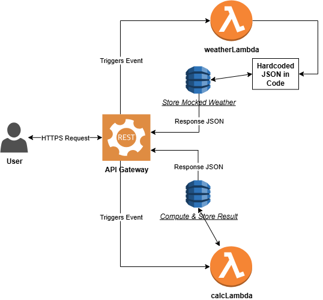

# serverless-api-project
A serverless RESTful API powered by AWS Lambda (Python/Boto3), API Gateway, and DynamoDB. Fetches real-time weather data and stores request metadata, with automated CI/CD via GitHub Actions.

## Requirements
- **Endpoints**:  
  | Endpoint | Method | Description | Input | Output |  
  |----------|--------|-------------|-------|--------|  
  | /weather | GET | Return and store mocked weather data | ?city=string | JSON mocked weather data |  
  | /calculate | POST | Perform and store calculation | JSON body: {"operation": string, "numbers": array} | JSON result with ID |
- **Data Storage**: DynamoDB table `apiData` with items like:
  - Weather: `{"city": "string", "type": "weather", "data": {...}, "timestamp": "string"}`
  - Calc: `{"id": "uuid", "type": "calc", "operation": "string", "result": number, "timestamp": "string"}`
- **Notes**: Weather uses hardcoded mock data in Lambda for simplicity and zero cost.

## Architecture
High-level serverless flow using AWS services with mock data:  

## Data Model  
- **Table**: apiData (DynamoDB, single-table design).  
- **Keys**: Partition Key = 'pk' (e.g., 'weather#city' or 'calc#id'), Sort Key = 'timestamp' (for history sorting).  
- **Example Items**:  
  - Weather: `{"pk": "weather#London", "timestamp": "...", "type": "weather", "data": {"temperature": 20, ...}}`  
  - Calculation: `{"pk": "calc#uuid-123", "timestamp": "...", "type": "calc", "operation": "add", "result": 5}`  
- **Notes**: Uses on-demand billing for scalability; mock data stored as-is.  
